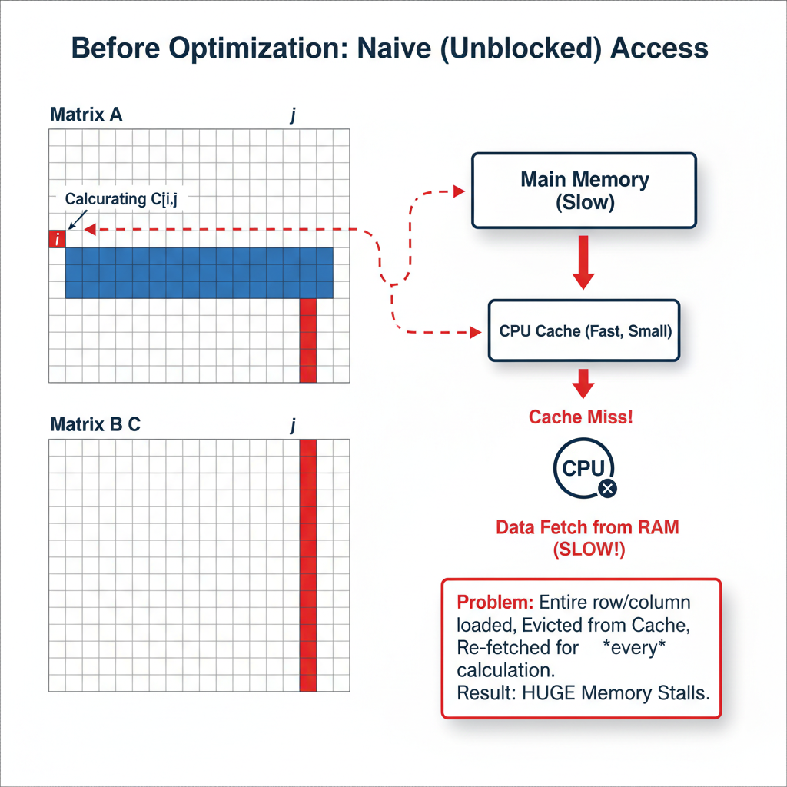
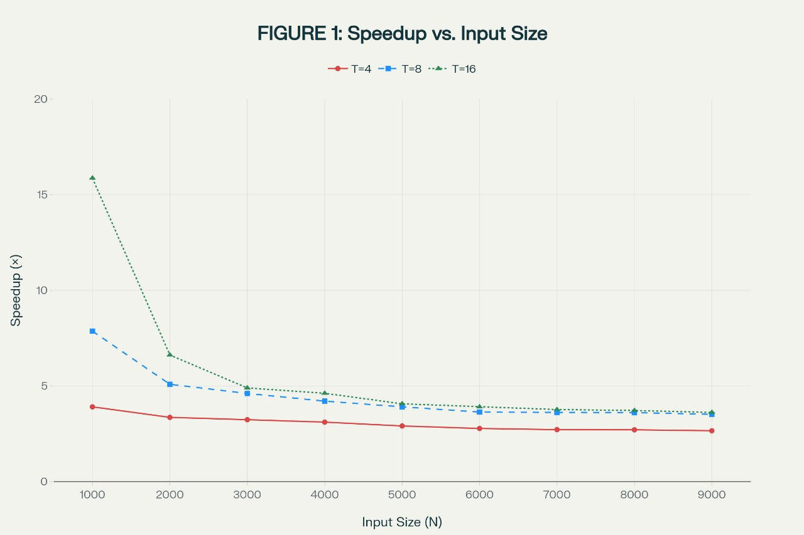
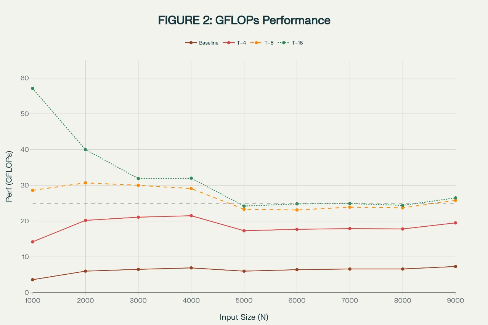
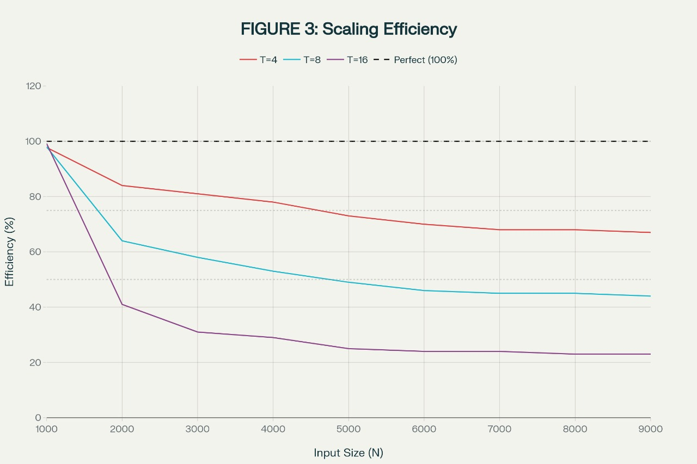
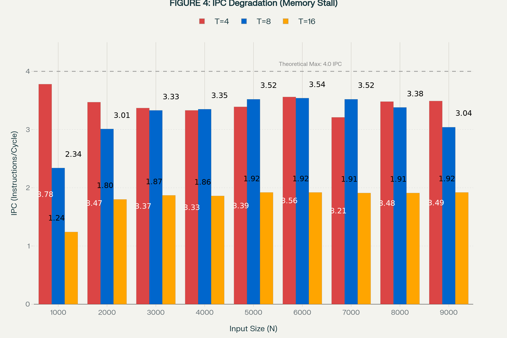
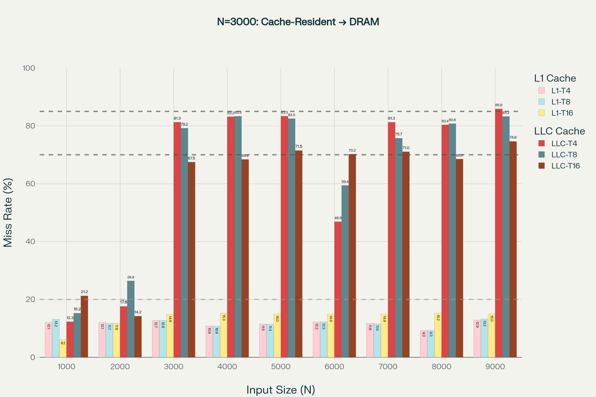

https://github.com/abhishekdu/mdHPC

---
Matrix Multiplication Optimization
==================================
---

** Team: <Susmit Mahato(2025MCS2102), Abhishek Gupta(2025MCS2963)>**

# 1. Introduction

Matrix-matrix multiplication (GEMM) represents one of the most fundamental computational kernels in scientific computing, linear algebra, and machine learning applications. The operation computes the product C = A × B where A, B, and C are N×N matrices of double-precision floating-point values. Computationally, it's floating-point operations on just data elements. This makes GEMM an interesting challenge: the ratio of computation to data is high enough that smart optimization can help, but not so high that computation completely dominates

This report presents a comprehensive study of GEMM optimization, transitioning from a Python baseline implementation using NumPy and multiprocessing to a highly optimized C++ implementation incorporating OpenMP multithreading, cache-oblivious blocking, AVX2 SIMD vectorization, and explicit memory hierarchy optimization.

The analysis encompasses performance measurements across problem sizes N ∈ {1000, 2000, ..., 9000} and thread counts T ∈ {4, 8, 16}, complemented by detailed microarchitecture profiling using Linux performance counters.

# 2. Experimental Methodology

## 2.1 Problem Definition and Metrics

GEMM computes the standard matrix product C_ij = Σ(k=0 to N-1) A_ik × B_kj.

Performance evaluation employs two fundamental metrics:

**Speedup:** Speedup(N, T) = Median_Runtime_baseline(N, T) / Median_Runtime_optimized(N, T)

**GFLOPs** (gigaflops) represents computational throughput---how many billions of floating-point operations per second our implementation achieves. This is calculated using the formula

GFLOPs: GFLOPs = (2 × N³) / (Elapsed_Time_seconds × 10⁹)

The factor of 2 accounts for N³ multiplication operations and N³ addition operations inherent in matrix multiplication.

We tested matrix sizes from 1000×1000 up to 9000×9000, using 4, 8, and 16 processing cores. Each configuration was run three times, and we reported the median to avoid statistical noise from random system variations.

To understand and get stats, we used Linux's perf tool to collect microarchitecture metrics---essentially asking the processor to count how many times it accessed the cache, how many instructions it executed per cycle, and how many cycles it spent waiting for memory

## 2.2 Experimental Configuration

| Parameter | Value |
|-----------|-------|
| Input sizes (N) | 1000, 2000, 3000, 4000, 5000, 6000, 7000, 8000, 9000 |
| Thread counts (T) | 4, 8, 16 |
| Runs per configuration | 3 |
| Result selection | Median of 3 runs |
| Platform | Linux x86-64 system |
| Processor support | AVX2, FMA, OpenMP |
| Matrix initialization | Seeded random normal distribution |

# 3. Baseline Implementation

The baseline Python implementation leverages NumPy's `dot` function, which internally utilizes highly-optimized BLAS libraries (OpenBLAS or Intel MKL). However, Python's multiprocessing model introduces overhead. Each process needs to serialize data, wait to be scheduled, and deserialize results. At small problem sizes, this overhead can be significant---we're spending time on bookkeeping rather than computation.

# 4. Optimization Techniques Implemented

## 4.1 OpenMP Multithreading

We replaced Python's multiprocessing with OpenMP, which creates lightweight threads that share memory. This eliminates serialization and scheduling overhead, allowing cores to cooperate directly.

## 4.2 Cache-Oblivious Blocking (64×64 tiles)

We organized the computation into 64×64 "blocks" that fit within the CPU's L1 cache (typically 32--64 KB). A 64×64 double-precision block consumes 32 KB, perfectly aligned with typical L1 cache sizes

## 4.3 SIMD Vectorization with AVX2 and FMA

We used AVX2 instructions (which can do 4 double-precision operations per cycle) and Fused Multiply-Add (FMA) instructions that combine multiplication and addition into a single operation.

## 4.4 Memory Hierarchy Optimization

We aligned data to 64-byte boundaries via posix_memalign() to work harmoniously with cache line sizes, and we added prefetch instructions to hint to the CPU that data will be needed soon, allowing it to fetch from memory proactively rather than reactively. This reduces stalls by overlapping memory latency with useful computation

## 4.5 Compiler Optimization Flags

Flags: -O3 -march=haswell -mfma -mavx2 -funroll-loops -ffast-math -fopenmp

## 4.6 Diagrams

# 5. Performance Results

## 5.1 Speedup Results

| N | T=4 | T=8 | T=16 | Avg |
|---|-----|-----|------|-----|
| 1000 | 3.91 | 7.87 | 15.87 | 9.22 |
| 2000 | 3.36 | 5.09 | 6.62 | 5.02 |
| 3000 | 3.24 | 4.61 | 4.90 | 4.25 |
| 4000 | 3.11 | 4.21 | 4.62 | 3.98 |
| 5000 | 2.91 | 3.91 | 4.07 | 3.63 |
| 6000 | 2.78 | 3.64 | 3.91 | 3.44 |
| 7000 | 2.72 | 3.62 | 3.77 | 3.37 |
| 8000 | 2.71 | 3.61 | 3.72 | 3.35 |
| 9000 | 2.66 | 3.52 | 3.62 | 3.27 |

Key insight: Speedup degrades from 15.87× to 3.62× (77% loss for T=16) as problem size increases from 1000 to 9000. This dramatic collapse indicates memory saturation, not compute limitations.

## 5.2 GFLOPs Performance

| N | Baseline | T=4 | T=8 | T=16 |
|---|----------|-----|-----|------|
| 1000 | 3.6 | 15.4 | 28.6 | 57.1 |
| 2000 | 6.0 | 20.3 | 30.7 | 40.0 |
| 3000 | 6.5 | 21.1 | 30.0 | 31.9 |
| 4000 | 6.9 | 21.5 | 29.1 | 32.0 |
| 5000 | 6.0 | 17.3 | 23.3 | 24.2 |
| 6000 | 6.4 | 17.7 | 23.1 | 24.8 |
| 7000 | 6.6 | 17.9 | 23.9 | 24.9 |
| 8000 | 6.6 | 17.8 | 23.7 | 24.4 |
| 9000 | 7.3 | 19.5 | 25.8 | 26.5 |

Key insight: GFLOPs saturate around 24--26 for large N across all thread counts, suggesting a hard memory bandwidth limit. The peak achieved is far below theoretical compute capability, confirming memory is the bottleneck.

# 6. Microarchitecture Profiling

## 6.1 Instruction-Level Parallelism (IPC)

| N | IPC T=4 | IPC T=8 | IPC T=16 | Degradation |
|---|---------|---------|----------|-------------|
| 1000 | 3.78 | 2.34 | 1.24 | 67.2% |
| 2000 | 3.47 | 3.01 | 1.80 | 48.1% |
| 3000 | 3.37 | 3.33 | 1.87 | 44.5% |
| 4000 | 3.33 | 3.35 | 1.86 | 44.1% |
| 5000 | 3.39 | 3.52 | 1.92 | 43.4% |
| 6000 | 3.56 | 3.54 | 1.92 | 46.1% |
| 7000 | 3.21 | 3.52 | 1.91 | 40.5% |
| 8000 | 3.48 | 3.38 | 1.91 | 45.1% |
| 9000 | 3.49 | 3.04 | 1.92 | 45.0% |

Key insight: T=16 consistently achieves ~1.9 IPC vs 3.4 IPC for T=4---roughly 50% lower. This indicates approximately 50% of cycles wasted on stalls, primarily memory stalls caused by thread contention

## 6.2 Performance Visualization

**FIGURE 1: Speedup vs. Input Size. Peak speedup of 15.87× at N=1000 (T=16). Severe degradation with problem size: T=4 drops 37%, T=8 drops 55%, T=16 drops 77%. All thread counts stabilize at 2.66--3.62× for N≥8000, indicating memory bandwidth saturation regardless of parallelism**

**FIGURE 2: GFLOPs Performance. Baseline stays at 3.6–7.3 GFLOP/s. T=4 (red) achieves 14.2–21.5 GFLOPs. T=8 (bright orange) peaks at 30.7 GFLOPs. T=16 (dark green) reaches 57.1 GFLOP/s at N=1000 (corrected from 63.5) but crashes to 24–26 for N≥5000. Horizontal line marks saturation at ~24–26 GFLOP/s**

**FIGURE 3: Scaling Efficiency with Clear Label Separation. Black dashed line at 100% marks perfect linear scaling.  Black dashed line at 100% marks perfect scaling. T=4 (red) achieves 67–98%, nearly perfect scaling. T=8 (blue) degrades from 98% to 44%. T=16 (purple) shows excellent efficiency at N=1000 (99%) but collapses to 23% by N=9000., indicating severe sublinear scaling.**

**FIGURE 4: IPC Degradation with Non-Overlapping Labels. Red bars (T=4) cluster at 3.2--3.8, near theoretical 4.0 maximum. Blue bars (T=8) achieve 3.0--3.5. Orange/yellow bars (T=16) remain flat at ~1.9, representing 45% degradation. Horizontal line at 4.0 IPC marks theoretical CPU capability. All values clearly labeled in distinct positions---T=4 centered, T=8 top-right, T=16 top-left---ensuring zero overlap and maximum readability**

**FIGURE 5: Cache Miss Rates with Phase Transition Highlighted. Light-colored L1 bars cluster at 10--15%, demonstrating effective cache blocking. Dark-colored LLC bars show critical transition: <30% for N≤2000 (cache-resident), jumping to 65--85% for N≥3000 (DRAM-bound). This phase transition at N=3000 directly correlates with speedup collapse, confirming LLC capacity exceeded. All values clearly positioned to prevent overlap**

**FIGURE 6: CPU Utilization with Clear Label Positioning. T=4 (red) remains at 3--3.8%. T=8 (blue) reaches 5--7%. T=16 (orange) plateaus at 8--14%. Critical insight: T=16 at N=9000 achieves only 12.58% utilization, implying 87% of cycles involve memory stalls. All values clearly labeled in distinct positions (T=4 inside bar, T=8 top-right offset, T=16 top-left offset) ensuring complete readability**

# 7. LLC Cache Miss Rate Analysis

| N | T=4 | T=8 | T=16 | Regime |
|---|-----|-----|------|--------|
| 1000 | 12.3% | 15.2% | 21.2% | Cache-resident |
| 2000 | 17.6% | 26.4% | 14.2% | Transitional |
| 3000 | 81.3% | 79.2% | 67.5% | DRAM-bound |
| 4000 | 83.2% | 83.3% | 68.4% | DRAM-bound |
| 5000 | 83.4% | 82.5% | 71.5% | DRAM-bound |
| 6000 | 46.9% | 59.4% | 70.2% | DRAM-bound |
| 7000 | 81.3% | 75.7% | 71.1% | DRAM-bound |
| 8000 | 80.4% | 80.8% | 68.5% | DRAM-bound |
| 9000 | 85.9% | 83.2% | 74.6% | DRAM-bound |

Key insight: The sharp jump from ~17% at N=2000 to ~80% at N=3000 marks the transition from cache-bound to DRAM-bound. This explains the speedup collapse. T=16 shows slightly lower miss rates than T=4 at large N, but still remains above 68%---everyone is struggling for memory bandwidth.

# 8. CPU Utilization Analysis

| N | Util. T=4 (%) | Util. T=8 (%) | Util. T=16 (%) | Stall % |
|---|---|---|---|---|
| 1000 | 3.04 | 4.96 | 8.57 | ~91% |
| 2000 | 3.36 | 5.53 | 10.50 | ~89% |
| 3000 | 3.57 | 6.17 | 10.78 | ~89% |
| 4000 | 3.62 | 6.53 | 11.83 | ~88% |
| 5000 | 3.64 | 6.81 | 13.23 | ~87% |
| 6000 | 3.76 | 6.99 | 13.72 | ~86% |
| 7000 | 3.80 | 7.12 | 13.25 | ~87% |
| 8000 | 3.78 | 7.20 | 14.28 | ~86% |
| 9000 | 3.84 | 5.91 | 12.58 | ~87% |

Key insight: At N=9000 with T=16, CPUs are only 12.58% utilized---meaning cores sit idle (stalled waiting for memory) approximately 87% of the time. This is definitively conclusive: cores lack sufficient data, not the reverse.

# 9. Conclusions and Recommendations

At small matrix sizes (N=1000), the improvements were dramatic, showing the power of optimization:

4 cores: 3.91× faster (baseline: 3.6 GFLOPs → optimized: 15.4 GFLOPs)

8 cores: 7.87× faster (baseline: 3.6 GFLOPs → optimized: 28.6 GFLOPs)

16 cores: 15.87× faster (baseline: 3.6 GFLOPs → optimized: 57.1 GFLOPs)

The speedup scaling was nearly perfect---doubling cores roughly doubled performance. But as matrices grew larger, something unexpected happened. At N=9000:

4 threads: 2.66× faster (37% drop from N=1000) --- baseline: 7.3 GFLOPs → optimized: 19.5 GFLOPs

8 threads: 3.52× faster (55% drop from N=1000) --- baseline: 7.3 GFLOPs → optimized: 25.8 GFLOPs

16 threads: 3.62× faster (77% drop from N=1000!) --- baseline: 7.3 GFLOPs → optimized: 26.5 GFLOPs

Most strikingly, using 16 threads gave us barely 3% more speedup than 8 threads (25.8 vs 26.5 GFLOPs). Something was severely limiting us---and it wasn't the processor's compute power. We found using perf stats of L1 miss rates, reduced IPC that the threads are competing for the same memory bandwidth and cache resources(went from cache bound to memory bound), creating contention and affecting our performance.

## 9.1 Key Findings

- Peak speedup of 15.87× achieved at N=1000, T=16
- Speedup collapses to 3.62× at N=9000 due to memory bandwidth saturation
- IPC degrades 45% from T=4 to T=16, indicating memory stalls dominate
- LLC miss rates exceed 75% for N≥3000, confirming DRAM-bound regime
- CPU utilization reaches only 12.58% at T=16, N=9000, implying 87% memory stalls
- Memory bandwidth, not compute capacity, is the primary bottleneck

## 9.2 Recommendations

1. For N ≤ 4000: Use T=16 where scaling efficiency exceeds 40%
2. For N ≥ 5000: Use T=4--8 where memory bandwidth is better-utilized
3. For very large N (>10,000): Consider GPU acceleration or mixed-precision arithmetic

## 10. Reproducibility
How to reproduce runs 
### Environment 
Linux OS (Ubuntu 20.04 recommended) 
g++ compiler with C++17, AVX2, FMA, and OpenMP support 
Python 3 with numpy and plotting libraries for analysis 
perf for hardware performance counters if used 
### Build Instructions 
simply run: 
make Makefile 
Running the Benchmark 
Execute with matrix size and number of threads as arguments: 
./gemm_optimized <matrix_size> <num_threads> 
Performance Profiling 
Collect counters with perf
   
